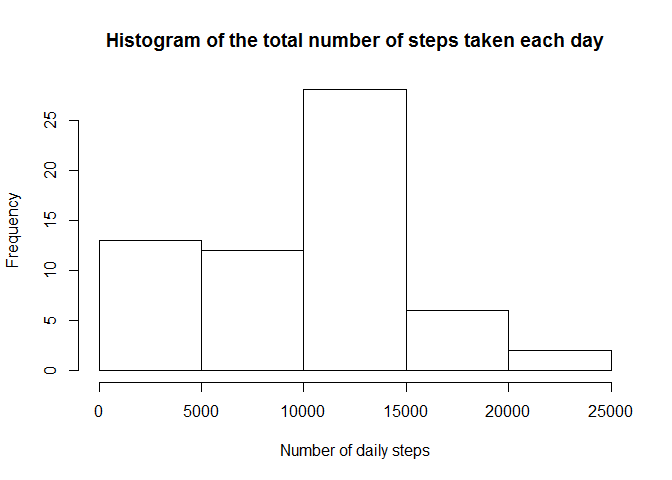
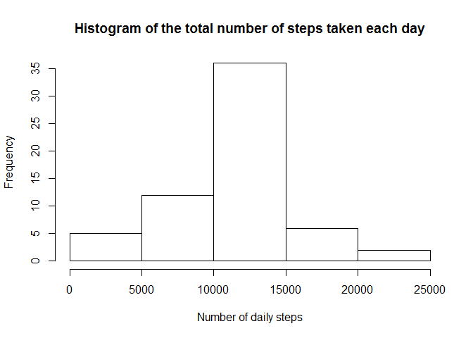
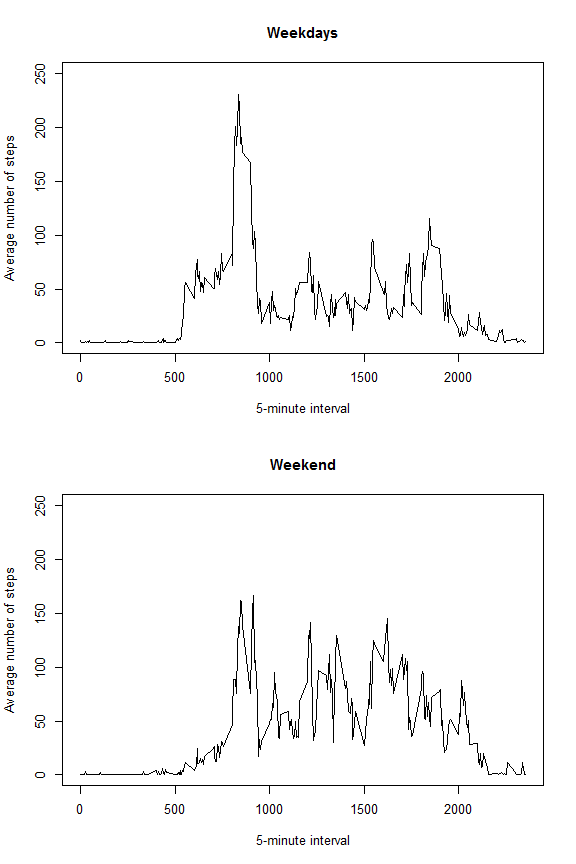

# Reproducible Research: Peer Assessment 1


## Loading and preprocessing the data


```r
# Unzip file
unzip("activity.zip")
# read data file
act <- read.csv("activity.csv")
# load data.table package
library(data.table)
```

```
## Warning: package 'data.table' was built under R version 3.1.3
```

```r
# transform data into data.table
act <- data.table(act)
# turn interval values into factors
act$interval <- as.factor(act$interval)
# create key for data table
setkey(act, date, interval)
```

## What is mean total number of steps taken per day?

```r
# Histogram of the total number of steps taken each day
daily_steps <- tapply(act$steps, act$date, sum, na.rm = TRUE)
hist(daily_steps, main = "Histogram of the total number of steps taken each day", xlab = "Number of daily steps")
```

 

```r
# Mean and Median of the total number of steps taken per day
summary(daily_steps)
```

```
##    Min. 1st Qu.  Median    Mean 3rd Qu.    Max. 
##       0    6778   10400    9354   12810   21190
```

- The mean of the total number of steps taken per day is 9354.
- The median of the total number of steps taken per day is 10400.


## What is the average daily activity pattern?

```r
avg_steps <- tapply(act$steps, act$interval, mean, na.rm = TRUE)
plot(names(avg_steps), avg_steps, type = "l", main = "Average daily activity pattern", xlab = "5-minute interval", ylab = "Average number of steps")
```

 

```r
# 5-minute interval that on average contains the maximum number of steps
max_steps <- max(avg_steps)
subset(avg_steps, avg_steps == max_steps)
```

```
##      835 
## 206.1698
```

- The 5-minute interval that on average contains the maximum number of steps is interval 835.
- The average number of steps for this interval is 206,17.


## Imputing missing values

```r
#  Total number of missing values in the dataset
sum(is.na(act))
```

```
## [1] 2304
```

```r
# Filling in all of the missing values. Create new dataset.
# Calculate mean for each 5-minute interval. Ignore NA's.
mean_interval_steps <- act[, mean(steps, na.rm = TRUE), by = interval]
# Name columns
setnames(mean_interval_steps, c("interval", "steps"))
# Create a data table with all rows that have NA steps
na_logical <- act[, is.na(steps)]
na_act <- act[na_logical, ]
# Delete steps column
na_act <- na_act[, steps := NULL]
# Merge data tables. Rows that had NA steps now have a mean calculated nr of steps
na_mean <- merge(na_act, mean_interval_steps, by = "interval")
# Create data table without the rows that have NA steps
cc_act <- act[!na_logical, ]
# Merge data tables. Get a complete data table for all days and intervals without NA steps
complete_act <- merge(cc_act, na_mean, by = c("date", "interval", "steps"), all = TRUE)

# Histogram of the total number of steps taken each day
complete_daily_steps <- tapply(complete_act$steps, complete_act$date, sum, na.rm = TRUE)
hist(complete_daily_steps, main = "Histogram of the total number of steps taken each day", xlab = "Number of daily steps")
```

 

```r
# Mean and Median of the total number of steps taken per day
summary(complete_daily_steps)
```

```
##    Min. 1st Qu.  Median    Mean 3rd Qu.    Max. 
##      41    9819   10770   10770   12810   21190
```

- The total number of missing values in the dataset is 2304.
- The mean and median of the total number of steps taken per day are both 10770. These values are higher than the estimates from the first part of the assignment. 
- Inputing the missing NAs lowers the frequency of 0-5000 nr of daily steps, and increases the others, especially 10000-15000 nr of daily steps.


## Are there differences in activity patterns between weekdays and weekends?

```r
# transform date into weekdays
week_days <- weekdays(as.Date(complete_act$date))
# substitute weekday days for "weekday"
week_days[week_days=="segunda-feira" | week_days=="terça-feira" | week_days=="quarta-feira" | week_days=="quinta-feira" | week_days=="sexta-feira"] = "weekday"
# substitute weekend days for "weekend"
week_days[week_days=="sábado" | week_days=="domingo"] = "weekend"
# add weekdays column to data table
complete_act$weekdays <- week_days

# subset weekday rows
act_weekday <- complete_act[weekdays=="weekday"]
# subset weekend rows
act_weekend <- complete_act[weekdays=="weekend"]
# calculate weekday steps average
avg_weekday <- tapply(act_weekday$steps, act_weekday$interval, mean, na.rm = TRUE)
# calculate weekend steps average
avg_weekend <- tapply(act_weekend$steps, act_weekend$interval, mean, na.rm = TRUE)

# building the plot
par(mfrow = c(2, 1), cex = 0.8)
plot(names(avg_weekday), avg_weekday, type = "l", main = "Weekdays", xlab = "5-minute interval", ylab = "Average number of steps", ylim = c(0, 250))
plot(names(avg_weekend), avg_weekend, type = "l", main = "Weekend", xlab = "5-minute interval", ylab = "Average number of steps", ylim = c(0, 250))
```

 

- The activity patterns of weekdays and weekends are considerably different, which should account for different daily activities (work/leisure).
